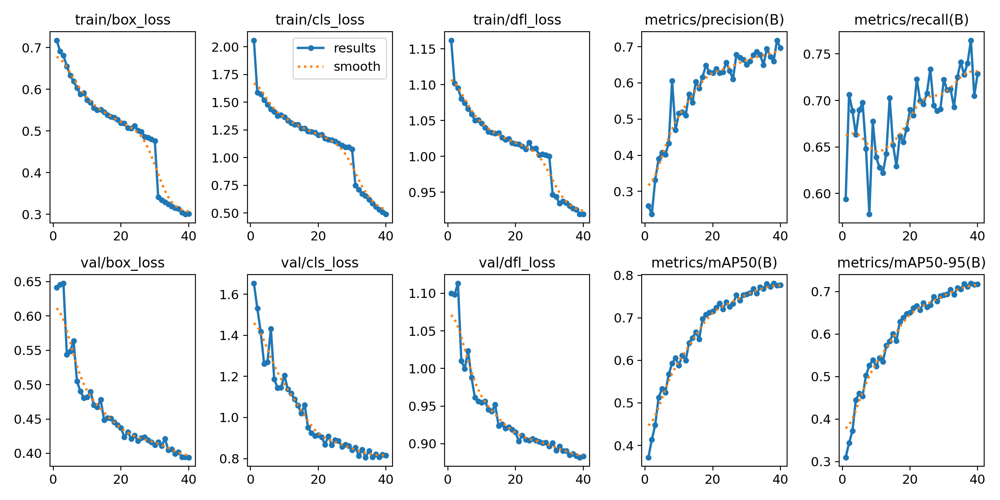

# Real-Time Emotion Detection Using YOLO11

This project implements a real-time facial emotion detection system using a YOLO11 object detection model.  
The model detects faces and classifies their emotional expression directly from a webcam feed.

## Project Overview
- Task: Facial emotion detection
- Model: YOLO11 (Ultralytics)
- Inference: Real-time webcam (local machine)
- Classes (8): anger, content, disgust, fear, happy, neutral, sad, surprise

## Dataset
The model was trained on the Human Face Emotions dataset provided via Ultralytics / Roboflow.

- Images: ~9,400
- Annotations: 9,538
- Median resolution: 640 × 640
- Average image size: ~0.41 MP
- Number of classes: 8

Dataset source:
https://universe.roboflow.com/home-0azaa/human-face-emotions-ks0rr

License: CC BY 4.0

## Setup & Installation
Create and activate your virtual environment, then install dependencies:

```bash
pip install -r requirements.txt
```
Required packages:
- ultralytics
- opencv-python
- numpy

## Run Real-Time Webcam Emotion Detection
This project uses a Python script that handles webcam access, frame capture, YOLO inference, and visualization.
```bash
python scripts/yolo_detect.py --model models/my_model.pt --source usb0
```
- source usb0 uses the default webcam
- Ctrl + c to quit


## Training Details

The model was trained using the Ultralytics YOLO11 framework with the following configuration:

- Image size: 416 × 416
- Epochs: 40
- Batch size: 16
- Task: Object detection (face bounding box + emotion class)

Training and validation losses decreased consistently, indicating stable convergence without significant overfitting.

The trained model was exported as a `.pt` file and used locally for real-time inference.

## Quantitative Results

Model performance on the validation set:

- Precision: ~0.70
- Recall: ~0.75
- mAP@50: ~0.78
- mAP@50–95: ~0.72

These results indicate reasonable detection and classification performance given the complexity of facial emotion recognition and the subjectivity of emotion labels.

## Training Curves

Training and validation loss curves, along with precision, recall, and mAP metrics, show steady improvement across epochs.

The model converges smoothly, suggesting that the selected training configuration was appropriate for the dataset.



## Real-Time Performance (Webcam)

While validation metrics are strong, real-time webcam inference shows reduced accuracy due to:

- differences in lighting conditions
- smaller or partially occluded faces
- motion blur
- ambiguity between similar emotions (e.g., fear vs surprise)

This reflects a domain shift between the training data (static, curated images) and live webcam input.

## Future Improvements
- Increase input resolution (e.g., 640×640) to better capture facial details
- Add temporal smoothing across frames to reduce prediction flicker
- Introduce a two-stage pipeline: face detection followed by emotion classification
- Fine-tune the model using webcam-collected samples to reduce domain shift


## Credits
- Ultralytics YOLO: https://github.com/ultralytics/ultralytics
- Dataset: Human Face Emotions (Roboflow / Ultralytics)
- Webcam inference script adapted from: https://www.ejtech.io/code/yolo_detect.py